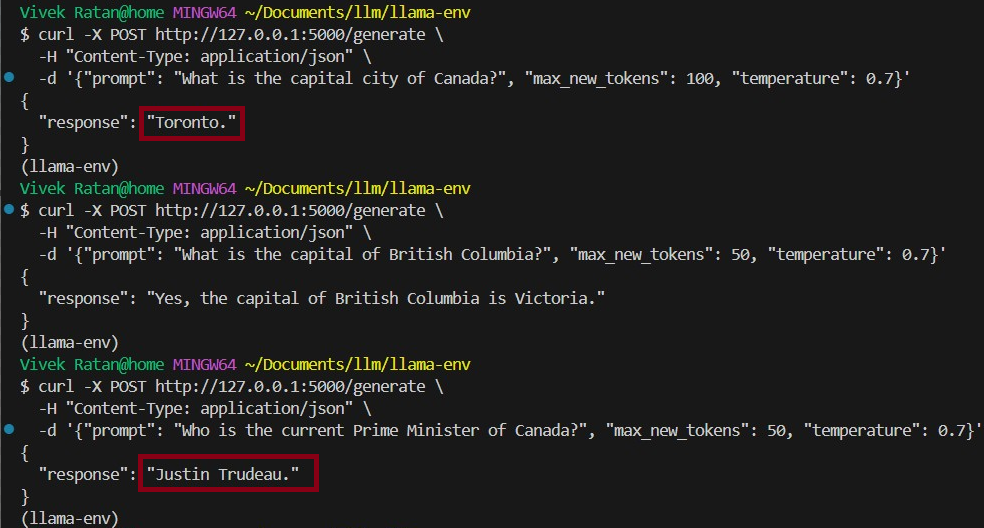
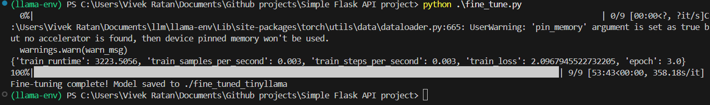
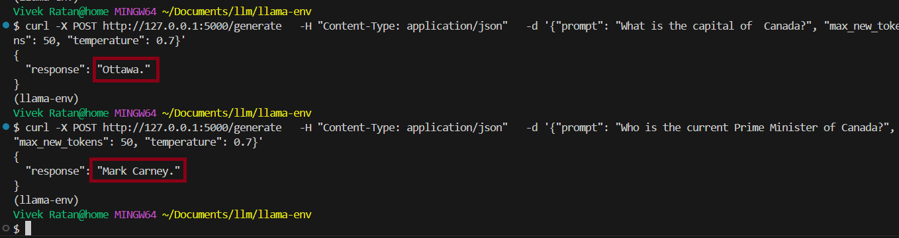

# 🧠 TinyLlama: Fine-Tuning & Inference

This project fine-tunes the **TinyLlama-1.1B-Chat** model on a custom dataset and compares its output with the base model using an inference prompt.

---

---

## 🔧 Requirements

- Python 3.8+
- PyTorch
- Hugging Face Transformers
- Datasets library

Install dependencies:

```bash
pip install torch transformers datasets

```
📚 Dataset Format
Your dataset should be in JSONL format like this:
```
{"instruction": "Write a poem", "input": "About the moon", "output": "The silver moon rises in grace..."}
```
🚀 Fine-Tuning
Edit the paths in train.py to point to:

 - Base model: TinyLlama-1.1B-Chat-v1.0

- Dataset: journey_finetune_50_styled.jsonl

Then run:
```bash
python train.py
```
What it does:

Loads and tokenizes your dataset

Fine-tunes the TinyLlama model

Saves the model and tokenizer to: tinyllama-ft/


🤖 Inference & Comparison
Edit paths in generate.py to match your:

- Base model folder

- Fine-tuned model folder

Then run:
```bash
python inference.py
```

What it does:

Prompts both models with the same input (e.g., "Poem about the moon")

Prints and compares their outputs


### Example Output prior to training it gave wrong output such
as given below:



### Training was done:



### Post training output:




