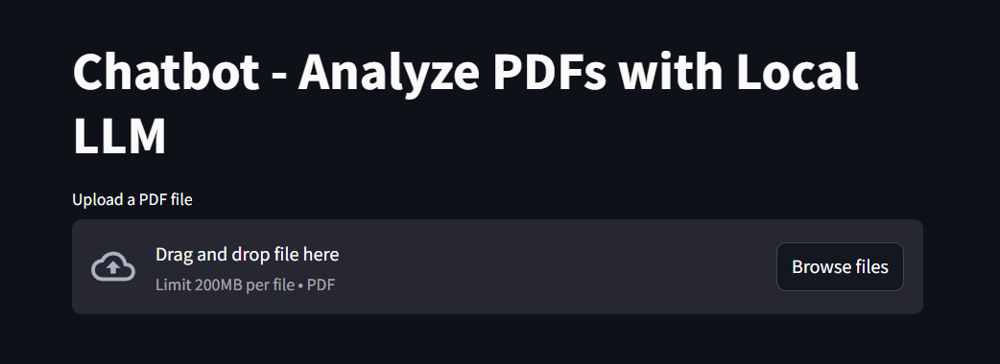
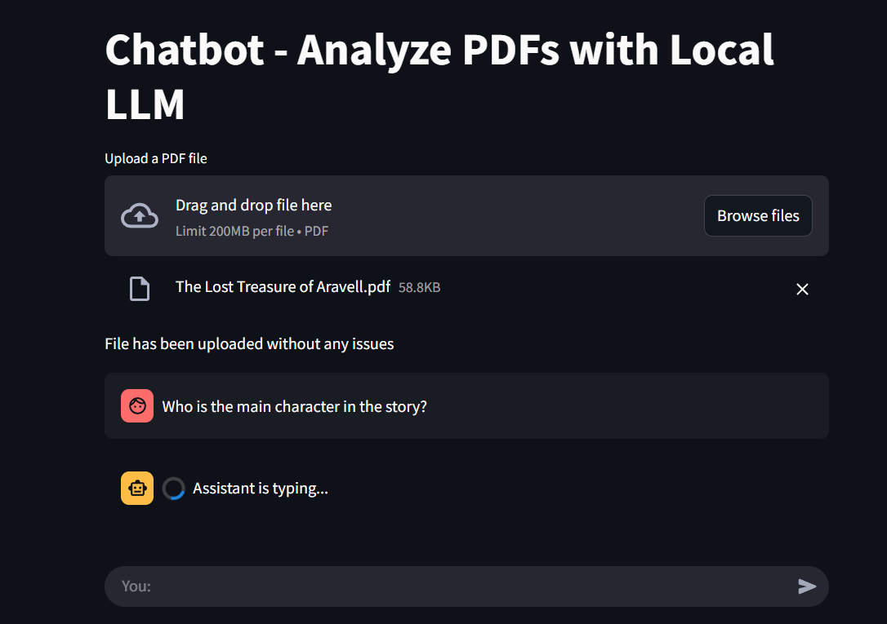
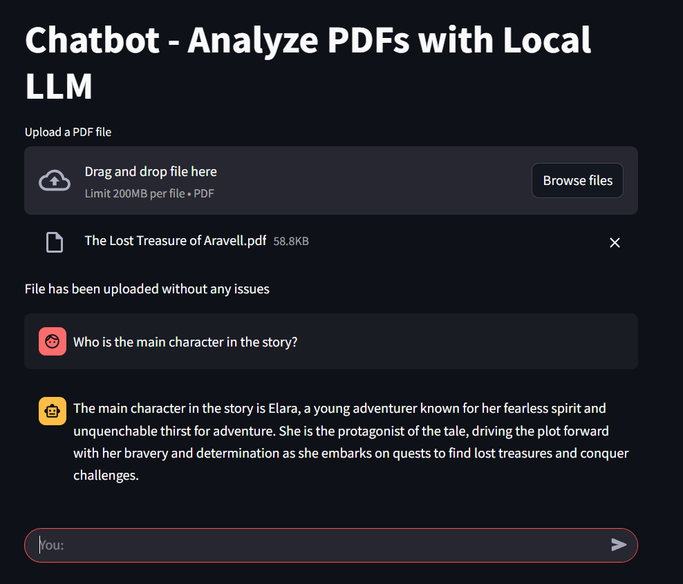

#  RAG Chatbot with Local LLM for analyzing PDF

This project is a PDF-powered chatbot built using **Streamlit**, **LangChain**, and a local **LLM (llama3.2)** via **Ollama**. Upload a PDF and ask questions about its content — the chatbot will answer based on what's in the document!

---

##  Features

- Upload any PDF and get intelligent responses
- Uses a local LLM (llama3.2) for privacy and speed
- Maintains conversation memory across chat turns
- Streams assistant responses in real time

---

##  Step-by-Step Instructions

###  Step 1: Upload a PDF

Upload any PDF file using the upload box.



---

###  Step 2: Process and Embed

The app processes the PDF, splits it into chunks, and embeds it into a vector database.



---

###  Step 3: Ask Questions

Ask natural language questions about the PDF content.



---

##  How to Run

1. **Install dependencies**:

   ```bash
   pip install streamlit langchain streamlit langchain-community langchain-ollama chromadb transformers
